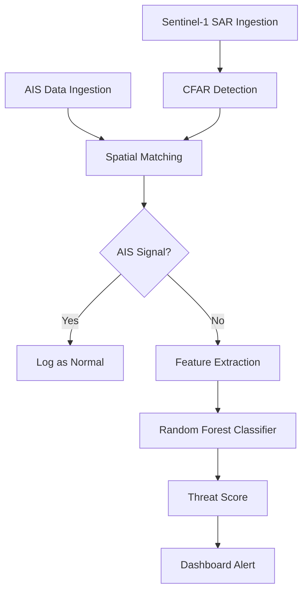

# Sentinel-Sea

**Maritime Surveillance System for Dark Vessel Detection**

A geospatial AI system for detecting non-cooperative ("dark") vessels operating inside Marine Protected Areas by fusing Sentinel-1 SAR satellite imagery with AIS vessel tracking data.

## 🎯 Project Overview

**Core Functionality:**
- Fuse Sentinel-1 SAR imagery with AIS vessel tracking data
- Detect vessels using CFAR (Constant False Alarm Rate) algorithm
- Perform spatial cross-validation between SAR detections and AIS broadcasts
- Classify anomalous detections (SAR without AIS match)

**Machine Learning:**
- Extract SAR-derived features (target area, backscatter intensity, elongation ratio)
- Random Forest classifier for vessel size estimation
- Threat score computation based on size, location, and AIS behavior

**System Outputs:**
- 🚨 Real-time anomaly alerts
- 📊 Historical detection playback
- 🎯 Risk prioritization queue
- ✅ Analyst confirmation feedback loop

## 🏗️ Architecture

```
sentinel-sea/
├── frontend/          # React + Vite + Tailwind + Leaflet
│   ├── src/
│   │   ├── components/
│   │   │   ├── Map.jsx         # Geospatial visualization
│   │   │   └── Sidebar.jsx     # Detections feed
│   │   ├── App.jsx
│   │   └── main.jsx
│   └── package.json
│
├── backend/           # Python + FastAPI
│   ├── app.py                  # Main API server
│   └── requirements.txt
│
└── docs/
    └── pipeline-flowchart.md   # Mermaid.js flowchart
```

## 🚀 Quick Start

### Backend (Python)

```bash
cd backend
python -m venv venv
venv\Scripts\activate  # Windows
pip install -r requirements.txt
python app.py
```

Backend runs on `http://localhost:8000`

### Frontend (React)

```bash
cd frontend
npm install
npm run dev
```

Frontend runs on `http://localhost:3000`

## 🔌 API Endpoints

| Endpoint | Method | Description |
|----------|--------|-------------|
| `/` | GET | Health check |
| `/api/detections/stream` | GET | Server-Sent Events stream of real-time detections |
| `/api/mpa` | GET | Marine Protected Area boundaries (GeoJSON) |

## 🎨 Design

**LeetCode-Inspired Dark Theme:**
- Background: Charcoal Black (#1A1A1A)
- Panels: Dark Gray (#262626)
- Accent: Restrained Orange (#FFA116)
- Text: Off-white (#E8E8E8) and Muted Gray (#A0A0A0)
- Alerts: Red (#FF0000) for critical warnings

## 📊 Detection Pipeline



## 🛡️ Technologies

- **Frontend**: React 18, Vite, Tailwind CSS, Leaflet
- **Backend**: Python, FastAPI, NumPy
- **Map Tiles**: CartoDB Dark Matter
- **Real-time**: Server-Sent Events (SSE)

## 📝 License

MIT License - see LICENSE file for details

---

**Built for maritime security and Marine Protected Area enforcement**
