# Sentinel-Sea Detection Pipeline

## Maritime Anomaly Detection System Flowchart

```mermaid
%%{init: {'theme':'dark', 'themeVariables': { 'primaryColor':'#262626', 'primaryTextColor':'#E8E8E8', 'primaryBorderColor':'#FFA116', 'lineColor':'#666', 'secondaryColor':'#1A1A1A', 'tertiaryColor':'#333', 'noteTextColor':'#E8E8E8', 'noteBkgColor':'#262626', 'noteBorderColor':'#FFA116'}}}%%

flowchart TD
    %% Data Ingestion
    A[Sentinel-1 SAR Ingestion<br/>Google Earth Engine] --> C
    B[AIS Data Ingestion<br/>Global Fishing Watch] --> D
    
    %% Processing
    C[CFAR-Based Vessel Detection<br/>Constant False Alarm Rate] --> E
    D[AIS Position Data<br/>Vessel Broadcasts] --> E
    
    %% Decision Point: Spatial Matching
    E{SAR–AIS Spatial Matching<br/>±500m Tolerance} -->|AIS Match Found| F1[Cooperative Vessel<br/>Low Priority]
    E -->|No AIS Match| F2[Anomalous Detection<br/>High Priority]
    
    %% Feature Extraction
    F1 --> G[Feature Extraction<br/>Area, Intensity, Shape]
    F2 --> G
    
    %% Classification
    G --> H[Random Forest Classification<br/>Vessel Size Estimation]
    
    %% Threat Scoring
    H --> I[Threat Score Computation<br/>AIS Status + Size + Location]
    
    %% Decision Point: Threat Level
    I --> J{Threat Score<br/>Threshold}
    J -->|Score ≥ 70| K1[HIGH Priority Alert]
    J -->|40 ≤ Score < 70| K2[MEDIUM Priority Alert]
    J -->|Score < 40| K3[LOW Priority Alert]
    
    %% Dashboard Display
    K1 --> L[Alert Display on Dashboard<br/>Real-time Visualization]
    K2 --> L
    K3 --> L
    
    %% Analyst Review
    L --> M[Analyst Review Action<br/>Manual Assessment]
    
    %% Decision Point: Analyst Decision
    M --> N{Analyst Decision}
    N -->|Confirm Anomaly| O1[Flag for Investigation<br/>Notify Authorities]
    N -->|Dismiss False Positive| O2[Remove from Queue<br/>Log Event]
    
    %% Feedback Loop
    O1 --> P[Feedback Stored<br/>Model Improvement]
    O2 --> P
    
    %% Continuous Improvement
    P -.->|Retrain Model| H
    
    %% Styling
    classDef inputNode fill:#1A1A1A,stroke:#FFA116,stroke-width:2px,color:#E8E8E8
    classDef processNode fill:#262626,stroke:#666,stroke-width:2px,color:#E8E8E8
    classDef decisionNode fill:#262626,stroke:#FFA116,stroke-width:3px,color:#FFA116
    classDef alertHigh fill:#4A0000,stroke:#FF0000,stroke-width:2px,color:#FF6666
    classDef alertMed fill:#4A2A00,stroke:#FFA116,stroke-width:2px,color:#FFA116
    classDef alertLow fill:#1A1A1A,stroke:#4CAF50,stroke-width:2px,color:#4CAF50
    classDef actionNode fill:#262626,stroke:#E8E8E8,stroke-width:2px,color:#E8E8E8
    classDef feedbackNode fill:#1A1A1A,stroke:#4CAF50,stroke-width:2px,color:#4CAF50
    
    class A,B inputNode
    class C,D,G,H,I processNode
    class E,J,N decisionNode
    class K1 alertHigh
    class K2 alertMed
    class K3 alertLow
    class F1,F2,L,M,O1,O2 actionNode
    class P feedbackNode
```

## Pipeline Description

### Data Ingestion Layer
1. **Sentinel-1 SAR Ingestion**: Synthetic Aperture Radar imagery from Google Earth Engine provides vessel backscatter signatures
2. **AIS Data Ingestion**: Automatic Identification System data from Global Fishing Watch tracks cooperative vessels

### Detection Layer
3. **CFAR-Based Vessel Detection**: Constant False Alarm Rate algorithm identifies bright targets in SAR imagery
4. **SAR-AIS Spatial Matching**: Cross-references SAR detections with AIS broadcasts within ±500m tolerance

### Analysis Layer
5. **Feature Extraction**: Extracts SAR-derived features (area, intensity, shape ratio) for each detection
6. **Random Forest Classification**: Machine learning model estimates vessel size and characteristics
7. **Threat Score Computation**: Combines AIS status, vessel size, and MPA location to calculate risk score

### Presentation Layer
8. **Alert Display on Dashboard**: Real-time visualization with threat-based color coding
9. **Analyst Review Action**: Human-in-the-loop review and decision-making

### Feedback Loop
10. **Feedback Stored for Model Improvement**: Analyst decisions feed back into model retraining pipeline

## Key Decision Points

| Decision Node | Criteria | Outcome |
|--------------|----------|---------|
| **SAR-AIS Matching** | Spatial tolerance ±500m | Match → Cooperative / No Match → Anomalous |
| **Threat Assessment** | Score ≥ 70 / 40-69 / < 40 | HIGH / MEDIUM / LOW priority |
| **Analyst Decision** | Manual review | Confirm → Investigate / Dismiss → Archive |

## Color Legend

- 🔵 **Input Nodes**: Orange borders (data sources)
- ⚫ **Process Nodes**: Gray borders (automated processing)
- 🟠 **Decision Nodes**: Orange borders and text (critical decision points)
- 🔴 **High Alerts**: Red highlights (immediate attention required)
- 🟡 **Medium Alerts**: Orange highlights (review required)
- 🟢 **Low Alerts**: Green highlights (routine monitoring)
- ✅ **Feedback Loop**: Dashed line (continuous improvement)
